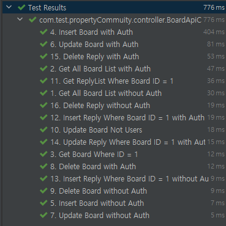
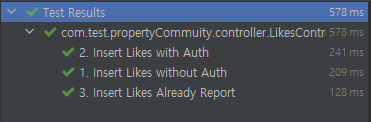

# 부동산 커뮤니티
## H2 DATABASE
url : jdbc:h2:tcp://localhost/~/test
username : sa

### DATABASE setup
유저관련 정보 셋업을 위한 Rest API 구현

    DROP TABLE IF EXISTS likes_user;
    DROP TABLE IF EXISTS likes;
    DROP TABLE IF EXISTS reply;
    DROP TABLE IF EXISTS board;
    DROP TABLE IF EXISTS member;
    DROP TABLE IF EXISTS account_type;

    /* 멤버 권한명 테이블 */
    create table account_type (
		account_type_eng varchar(100) not null,
        account_type_kor varchar(100) not null,
        primary key (account_type_eng)
    );

    /* 기본 데이터 셋업 */
	insert into account_type values('REALTOR', '공인중개사');
	insert into account_type values('LESSOR', '임대인');
	insert into account_type values('LESSEE', '임차인');

    /* 유저 정보 테이블 */
    create table member (
		id bigint auto_increment,
		account_id varchar(255) not null,
		account_type varchar(100),        
        nick_name varchar(255) not null,
        quit integer default 0,
        primary key (id),
		foreign key (account_type) references account_type(account_type_eng)
    );

    /* 기본 데이터 셋업 */
	insert into member values(1, 'realtorId', 'REALTOR', 'realtorNickname', 0);
	insert into member values(2, 'lessorId', 'LESSOR', 'lessorNickname', 0);
	insert into member values(3, 'lesseeId', 'LESSEE', 'lesseeNickname', 0);

    /* 게시판 및 댓글 테이블*/
    create table board (
		id bigint auto_increment,
		parent_id bigint,
		user_id bigint not null,		
		title varchar(4000),
        content varchar(4000) not null,
        created_at timestamp,
        updated_at timestamp,		
        deleted_at timestamp,
		likes bigint,
		is_deleted integer default 0,
        primary key (id),
		foreign key (user_id) references member(id)
    );
    /* 좋아요 정보 테이블 */
	create table likes_user (
		id bigint auto_increment,
        board_id bigint,
		user_id bigint,
        primary key (id),
		foreign key (user_id) references member(id),
		foreign key (board_id) references board(id)			
    );


## 검증
1. 검증을 위한 기본 데이터 세팅을 위해 Postman을 사용하여 각 메소드 별 CRUD 확인 및 권한체크.
2. 모든 GET method 테스트 케이스 작성 Request Header 내 
Authorization의 유무에 따른 POST, PUT, DELETE 테스트 케이스 작성 및 테스트 완료
> 
## 구현방식
1. 모든 데이터는 ApiResponseUtil 제네릭 클래스를 정의하여 response data format을 규격화함.
```
    {
        "statusCode" : "서버 응답 코드",
        "message" : "서버 응답 메세지. 오류일 경우 오류 관련 메세지"
        "data" : "제네릭 타입으로 각 DTO 및 여러 데이터 일 경우 HashMap 반환"
    }
```
2. Entity와 DTO 분리
3. Requset Header에 포함된 Authorization은 AuthInterceptor에서 파싱하여 파라미터화. 
해당 파라미터는 각 Controller에서 userId를 DTO에 삽입.
```
    HttpServletRequest.setAttribute("accountType", accountType);
    HttpServletRequest.setAttribute("userId", userId);
```
4. AuthInterceptor에서 Request method를 확인하고 GET 요청이 아닐경우 AuthController로 redirect.
```
    @GetMapping("/notAllowed")
    public ApiResponseUtil notAllowed() {
        return new ApiResponseUtil(HttpStatus.UNAUTHORIZED.value(), 
            HttpStatus.UNAUTHORIZED.getReasonPhrase(), 
            null);
    }
```
5. POST, PUT, DELETE 요청은 valid 메소드를 정의하여 해당 글(게시글, 댓글)의 정보와 대조하도록 함. 
```
    private void valid(BoardDto dto) throws Exception{
        if(!boardService.isUsersBoard(dto.getMember().getId(), dto.getId())) 
            throw new Exception("Not Found");
    }
```
6. 좋아요 처리시 Board와 LikesUser의 트랜잭션 처리를 위해 LikesUserBoardService를 생성하고
처리 실패 시 모두 rollback 처리하도록 함.
```
    @Transactional(rollbackFor = Exception.class)
    public void save(LikesUserDto dto) throws Exception{
        BoardDto boardDto = boardRepository.findById(dto.getBoard().getId())
                .orElseThrow(() -> new Exception("Board Not Found")).toDto();
        boardDto.setLikes(boardDto.getLikes() + 1L);
        boardRepository.save(boardDto.toEntity());

        dto.setBoard(boardDto.toEntity());
        likesUserRepository.save(dto.toEntity());
    }
```
